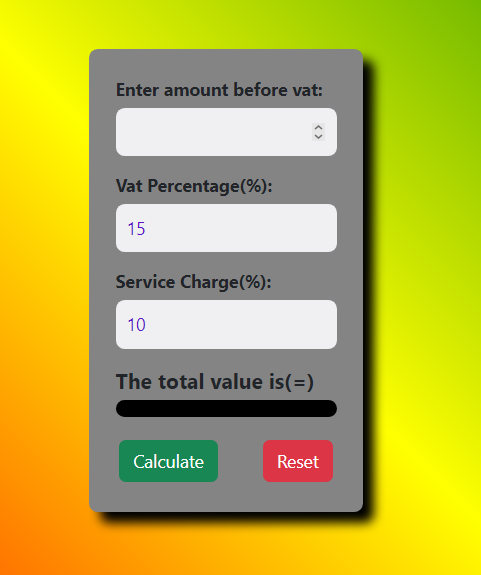
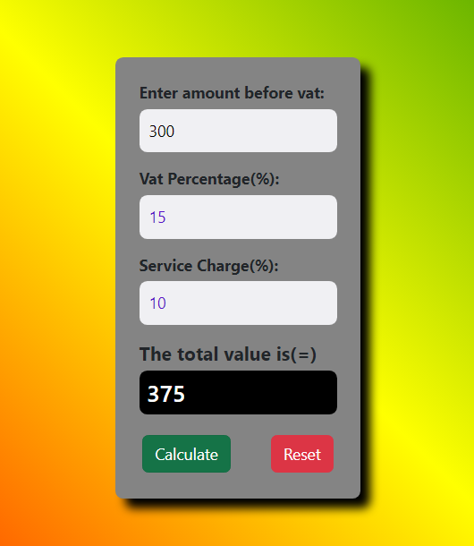
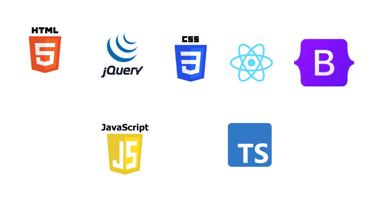

# VatService Calculator ~ Everything become simpler

;

## INTRODUCTION

In Ethiopa when anything is sold or bought, a 15% tax is paid
to the government. When is comes to hotel and resturants, customers
pay 10% service charge in addation to 15% tax after using the
service. This service charge accured and added to the employee's
salary at the end of the month.

Usually when I go to cafe and resturant and look at the menu, the
price on the menu does not include tax and service charge. So I
have seen many customers who even see at the menu and find it
difficult to know whether the service in their pocket is enough for
the service they want or not. Especially if they think they don't
have enough money.

Because of this uncertainty, they may end up using something they don't want.

And this portfolio project allows customers to know for sure what
the total price will be, including service charge and vat, after
looking the menu.

## PROJECT

## link to project

you can find the project link [here](https://vat-service-calculator-alx-portfolio.netlify.app)

## Technology used in this project

### This are the technology that I used in the project

- HTML5
- CSS3
- JavaScript
- React
- Bootstrap
- JQuery
- TypeScript
  

## Licence

MIT License
